# AWS Infrastructure as Code 🏗️


[](https://github.com/actions)

Enterprise-grade AWS infrastructure using Terraform, featuring comprehensive security, monitoring, and automation.

## ✨ Features

- 🔐 **Security First**: KMS encryption, WAF protection, GuardDuty integration
- 🚀 **CI/CD Pipeline**: AWS CodePipeline with GitHub/CodeCommit integration
- 🌐 **Content Delivery**: CloudFront with WAF and custom origins
- 💾 **Backup & Recovery**: Cross-region backups with lifecycle management
- 📊 **Monitoring**: CloudWatch, X-Ray, and custom metrics
- 🔒 **State Management**: S3 backend with DynamoDB locking

## 🏗️ Architecture

```mermaid
graph TB
    %% External Services
    GitHub[("GitHub/CodeCommit\n📦")] --> CodePipeline
    
    subgraph AWS Cloud
        %% Network Layer
        subgraph VPC ["VPC 🌐"]
            direction TB
            subgraph Public ["Public Subnets"]
                ALB["Application Load Balancer ⚖️"]
                NAT["NAT Gateway 🔒"]
            end
            
            subgraph Private ["Private Subnets"]
                ECS["ECS Cluster 🐳"]
                RDS[("RDS 💾")]
                EFS[("EFS 🗃️")]
            end
            
            Public --> Private
        end
        
        %% Security Layer
        WAF["WAF 🛡️"] --> CloudFront
        GuardDuty["GuardDuty 🔍"]
        Config["AWS Config ⚙️"]
        
        %% CDN Layer
        CloudFront["CloudFront 🌐"] --> ALB
        CloudFront --> S3
        
        %% CI/CD Pipeline
        subgraph Pipeline ["CI/CD Pipeline 🚀"]
            CodePipeline --> CodeBuild
            CodeBuild --> ECR[("ECR Registry 📦")]
            ECR --> ECS
        end
        
        %% Storage Layer
        S3[("S3 Buckets 🪣")]
        Backup["AWS Backup 💾"] --> |Protects| RDS
        Backup --> |Protects| EFS
        
        %% Security Services
        KMS["KMS 🔑"] --> |Encrypts| S3
        KMS --> |Encrypts| RDS
        KMS --> |Encrypts| SecretsManager
        
        %% Management Layer
        CloudWatch["CloudWatch 📊"]
        CloudTrail["CloudTrail 📝"]
        SecretsManager["Secrets Manager 🔐"]
        
        %% Monitoring Connections
        ECS --> CloudWatch
        RDS --> CloudWatch
        ALB --> CloudWatch
        
        %% DNS Management
        Route53["Route 53 🔍"] --> CloudFront
    end
    
    %% External Access
    Users["Users 👥"] --> Route53
    Admins["Administrators 👤"] --> |Access| AWS["AWS Console ☁️"]

    classDef aws fill:#ff9900,stroke:#232f3e,stroke-width:2px,color:#232f3e;
    classDef security fill:#dd3522,stroke:#232f3e,stroke-width:2px,color:white;
    classDef network fill:#3b48cc,stroke:#232f3e,stroke-width:2px,color:white;
    
    class ALB,ECS,RDS,EFS,S3,ECR aws;
    class WAF,GuardDuty,KMS,SecretsManager security;
    class VPC,CloudFront,Route53 network;
```



## 🚀 Quick Start

1. **Prerequisites**
```bash
aws --version  # AWS CLI v2+
terraform -v   # Terraform v1.0+
```

2. **Clone & Initialize**
```bash
git clone https://github.com/Naem-ali/terraform.git
cd terraform
terraform init
```

3. **Deploy Infrastructure**
```bash
terraform workspace new dev
terraform plan -out=tfplan
terraform apply tfplan
```

## ⚙️ Module Configuration

### Required Permissions

```hcl
{
  "Version": "2012-10-17",
  "Statement": [
    {
      "Effect": "Allow",
      "Action": [
        "s3:*",
        "ec2:*",
        "rds:*"
        # ...other required permissions...
      ],
      "Resource": "*"
    }
  ]
}
```

### Input Variables

| Name | Description | Type | Default |
|------|-------------|------|---------|
| `project` | Project name | `string` | - |
| `env` | Environment name | `string` | - |
| `region` | AWS region | `string` | `us-west-2` |

### Outputs

| Name | Description |
|------|-------------|
| `vpc_id` | VPC ID |
| `public_subnets` | List of public subnet IDs |
| `private_subnets` | List of private subnet IDs |

## 🧪 Testing & CI

```bash
# Run pre-commit hooks
pre-commit run --all-files

# Run security checks
tfsec .
checkov -d .

# Run integration tests
go test -v ./test/...
```

## 📦 Modules

| Module | Description | Status |
|--------|-------------|--------|
| [VPC](./modules/vpc) | Network infrastructure | ✅ |
| [ECS](./modules/ecs) | Container orchestration | ✅ |
| [KMS](./modules/kms) | Key management | ✅ |
| [Backup](./modules/backup) | AWS Backup configuration | ✅ |

## 🔒 Security Features

- ✅ KMS encryption for all sensitive data
- ✅ WAF protection for web applications
- ✅ GuardDuty threat detection
- ✅ CloudTrail audit logging
- ✅ VPC flow logs
- ✅ IAM least privilege


## 🤝 Contributing

1. Fork the repository
2. Create a feature branch
3. Commit your changes
4. Push to the branch
5. Open a Pull Request


# AWS Infrastructure as Code with Terraform

This project contains Terraform configurations for deploying a complete AWS infrastructure including VPC, ECS, ALB, monitoring, and security components.

## Prerequisites

- AWS CLI installed and configured
- Terraform >= 1.0
- tfsec (optional, for security scanning)
- Git

## Project Structure

```
/home/nick/Terraform/
├── infra/
│   ├── modules/
│   │   ├── acm/                 # SSL/TLS certificate management
│   │   ├── alb/                 # Application Load Balancer
│   │   ├── auto_healing/        # Auto recovery mechanisms
│   │   ├── backup/             # AWS Backup Management
│   │   ├── cicd/               # AWS CI/CD Pipeline
│   │   ├── cloudfront/         # CDN and WAF
│   │   │   ├── main.tf         # Distribution and WAF rules
│   │   │   └── variables.tf    # Configuration variables
│   │   ├── cloudtrail/         # Audit logging
│   │   │   ├── main.tf         # Trail configuration
│   │   │   ├── variables.tf    # Trail variables
│   │   │   └── outputs.tf      # Trail outputs
│   │   ├── cloudwatch_logs/     # Logging and monitoring
│   │   ├── config/             # AWS Config rules
│   │   ├── cost/               # Cost management
│   │   ├── ecs/                # Container services
│   │   ├── guardduty/          # Security monitoring
│   │   ├── kms/                # Key Management Service
│   │   ├── mutex_lock/         # State locking mechanism
│   │   ├── network_firewall/   # Network security
│   │   ├── route53/            # DNS management
│   │   ├── s3_logs/           # Log storage
│   │   ├── secrets/           # Secrets Management
│   │   │   ├── main.tf         # Secret resources
│   │   │   ├── variables.tf    # Configuration variables
│   │   │   └── outputs.tf      # Secret ARNs and names
│   │   ├── security_groups/    # Security group management
│   │   ├── sns/                # Notification service
│   │   ├── state_management/   # Terraform state configuration
│   │   ├── tags/              # Resource tagging
│   │   ├── vpc/               # Network infrastructure
│   │   └── xray/              # Distributed tracing
│   │
│   ├── environments/
│   │   ├── dev/               # Development environment
│   │   │   ├── backend.tf     # Backend configuration
│   │   │   ├── data.tf        # Data sources
│   │   │   ├── main.tf        # Main configuration
│   │   │   ├── providers.tf   # Provider configuration
│   │   │   ├── variables.tf   # Variable definitions
│   │   │   └── workspace.tf   # Workspace settings
│   │   │
│   │   ├── staging/          # Staging environment
│   │   └── prod/            # Production environment
│   │
│   └── global/              # Global configurations
│       ├── backend/         # Backend setup
│       └── iam/             # IAM configurations
│
├── scripts/
│   ├── backend/
│   │   ├── init-backend.sh          # Backend initialization
│   │   └── setup-state-lock.sh      # DynamoDB lock setup
│   │
│   ├── cleanup/
│   │   ├── cleanup-old-workspaces.sh # Workspace management
│   │   └── cleanup-state.sh         # State file cleanup
│   │
│   ├── validation/
│   │   ├── validate.sh              # Configuration validation
│   │   └── security-check.sh        # Security validation
│   │
│   └── deployment/
│       ├── switch-workspace.sh      # Workspace switching
│       └── test-infrastructure.sh   # Infrastructure testing
│
├── .gitignore              # Git ignore patterns
├── .pre-commit-config.yaml # Pre-commit hooks
├── Makefile               # Common commands
└── README.md              # Project documentation
```

## Quick Start

1. **Setup Backend Infrastructure**
```bash
# Initialize backend infrastructure
chmod +x scripts/setup-backend.sh
./scripts/setup-backend.sh
```

2. **Configure Variables**
- Copy and update environment variables:
```bash
cd infra/environments/dev
cp terraform.tfvars.example terraform.tfvars
```
- Update `terraform.tfvars` with your values
- Update domain name in Route53 configuration

3. **Initialize Terraform**
```bash
terraform init
```

4. **Validate Configuration**
```bash
chmod +x scripts/validate.sh
./scripts/validate.sh
```

5. **Deploy Infrastructure**
```bash
terraform apply tfplan
```

## Modules

- **VPC**: Network infrastructure
- **ECS**: Container orchestration
- **ALB**: Load balancing
- **Route53**: DNS management
- **ACM**: SSL/TLS certificates
- **CloudWatch**: Monitoring and logging
- **GuardDuty**: Security monitoring
- **Config**: Compliance rules
- **Auto Healing**: Self-healing infrastructure
- **KMS**: Key Management Service
- **Secrets**: Secrets Management
- **CloudTrail**: Audit logging
- **Backup**: AWS Backup Management
- **CI/CD**: AWS CodePipeline and CodeBuild
- **CloudFront**: Content Delivery and WAF Protection

## Key Management Service (KMS)

### Overview
The project includes a centralized KMS module for managing encryption keys across services:

1. **Service-Specific Keys**:
   - S3 bucket encryption
   - RDS database encryption
   - EBS volume encryption
   - Secrets Manager encryption
   - Lambda environment variables
   - CloudWatch Logs encryption

2. **Key Features**:
   - Automatic key rotation
   - Multi-region support
   - Custom retention periods
   - Service principal access
   - IAM role separation

3. **Security Controls**:
   - Administrator/User separation
   - Service-specific policies
   - Customizable key policies
   - Deletion protection


### Key Management
- Key creation and rotation
- Access policy management
- Service integration
- Monitoring and logging

## Secrets Management

### Overview
The project includes a comprehensive secrets management module supporting both AWS Secrets Manager and Parameter Store:

1. **Secrets Manager Features**:
   - Secure credential storage
   - Automatic rotation
   - Key-value pair support
   - JSON structure support
   - Recovery windows
   - KMS encryption

2. **Parameter Store Features**:
   - Configuration management
   - Hierarchical structure
   - Different parameter types
   - Tiered storage options
   - Secure string support

3. **Security Features**:
   - KMS integration
   - IAM role separation
   - Rotation policies
   - Access logging
   - Version tracking


## Backup Management

### Overview
The project includes a comprehensive AWS Backup module with:

1. **Backup Plans**:
   - Multiple backup schedules
   - Cross-region replication
   - Cold storage transition
   - Lifecycle management
   - Custom retention periods

2. **Protected Resources**:
   - RDS databases
   - EFS filesystems
   - DynamoDB tables
   - EBS volumes

3. **Security Features**:
   - KMS encryption
   - IAM role separation
   - Cross-region copies
   - Vault access control

4. **Management Features**:
   - Tag-based selection
   - Automated scheduling
   - Lifecycle policies
   - Recovery points


## Audit Logging with CloudTrail

### Overview
The project includes a comprehensive CloudTrail module for audit logging:

1. **Trail Configuration**:
   - Multi-region support
   - Organization-wide logging
   - Log file validation
   - CloudWatch integration
   - KMS encryption

2. **Event Types**:
   - Management events
   - Data events
   - API insights
   - Global service events

3. **Storage Features**:
   - S3 bucket management
   - Lifecycle policies
   - Access controls
   - Bucket encryption

4. **Security Controls**:
   - KMS encryption
   - IAM role separation
   - Log validation
   - Access monitoring


## Content Delivery and WAF Protection

### Overview
The project includes a comprehensive CloudFront and WAF module for content delivery and security:

1. **CloudFront Features**:
   - Multiple origin support
   - Custom cache behaviors
   - SSL/TLS configuration
   - Geographic restrictions
   - Price class management
   - S3 and ALB origins

2. **WAF Protection**:
   - SQL injection prevention
   - XSS protection
   - Rate limiting
   - Managed rule sets
   - Custom rule configuration

3. **Security Features**:
   - HTTPS enforcement
   - Modern TLS protocols
   - Origin access identity
   - Geographic blocking
   - Request filtering

4. **Performance Features**:
   - Global edge locations
   - Cache optimization
   - Compression
   - Origin failover
   - Health checks


### Best Practices
- Enable WAF protection
- Configure proper cache behaviors
- Use HTTPS only
- Implement rate limiting
- Monitor WAF metrics
- Regular rule updates
- Custom error responses
- Origin failover configuration

## Environment Management

- Development: `terraform workspace select dev`
- Staging: `terraform workspace select staging`
- Production: `terraform workspace select prod`

## Security Features

- WAF protection
- Network firewall
- GuardDuty enabled
- SSL/TLS encryption
- Private subnets
- Security groups
- NACLs

## Monitoring & Logging

- CloudWatch logs
- X-Ray tracing
- CloudWatch alarms
- Auto healing
- Performance metrics

## Backup & Recovery

- S3 versioning
- State file backup
- Multi-AZ deployment
- Auto healing

## Cost Management

- Cost allocation tags
- Budget alerts
- Dev environment auto-shutdown
- Resource optimization

## CI/CD Pipeline Integration

### AWS CodePipeline Overview
The project includes a comprehensive CI/CD solution using AWS native services:

1. **Pipeline Stages**:
   - Source (GitHub/CodeCommit)
   - Build (CodeBuild)
   - Deploy (ECS/Lambda/S3)
   - Test and Validation

2. **Build Features**:
   - Custom build environments
   - Docker support
   - Environment variables
   - Build caching
   - Test integration

3. **Deployment Options**:
   - ECS services
   - Lambda functions
   - S3 static sites
   - Blue/Green deployment

4. **Security Features**:
   - KMS encryption
   - IAM role separation
   - Artifact versioning
   - Secret management


### Pipeline Features

```bash
# View pipeline status
aws codepipeline get-pipeline-state --name my-pipeline

# Start execution
aws codepipeline start-pipeline-execution --name my-pipeline

# View build logs
aws codebuild batch-get-builds --ids build-id

# Check deployments
aws ecs describe-services --cluster my-cluster --services my-service
```

### Environment Protection
- Approval actions
- Environment segregation
- IAM restrictions
- Deployment guards

### Build Configuration
- Custom Docker images
- Build specifications
- Test integration
- Security scanning

### Best Practices
- Use source control
- Implement testing
- Enable notifications
- Monitor deployments
- Regular maintenance

## Deployment Process

1. **Development**:
   ```bash
   # Switch to dev workspace
   ./scripts/switch-workspace.sh dev
   
   # Deploy changes
   make plan
   make apply
   ```

2. **Staging/Production**:
   - Create pull request
   - Wait for CI validation
   - Get approval
   - Merge to main
   - Automated deployment

## State Management and Mutex Locking

### Backend Configuration
The project uses a secure S3 backend with DynamoDB for state locking:

- **State Storage**: S3 with encryption and versioning
- **State Locking**: DynamoDB with global tables
- **Security**: KMS encryption and access logging

```bash
# Initialize backend for new environment
./scripts/init-backend.sh dev
```

### Features

1. **S3 Backend**
   - Versioning enabled
   - Server-side encryption
   - Access logging
   - Lifecycle management
   - Public access blocked

2. **DynamoDB Locking**
   - Global tables for multi-region support
   - Point-in-time recovery
   - TTL for stale locks
   - Auto-scaling enabled
   - Encryption at rest

3. **Security Measures**
   - KMS key rotation
   - Access logging
   - IAM role separation
   - Encryption in transit
   - Bucket policies

### Workspace Management
```bash
# Create/switch workspace
terraform workspace new dev
terraform workspace select dev

# List workspaces
terraform workspace list
```

### State Operations
```bash
# Force unlock state
terraform force-unlock [LOCK_ID]

# List state
terraform state list

# Show state
terraform state show [RESOURCE]
```

## Pipeline Security Features
- Environment protection rules
- Manual approval for production
- Secrets management
- Security scanning
- Compliance checks

## Troubleshooting

Common issues and solutions:

1. **Backend Initialization Fails**
```bash
terraform init -reconfigure
```

2. **State Lock Issues**
```bash
terraform force-unlock [LOCK_ID]
```

3. **Resource Cleanup**
```bash
terraform destroy -target=MODULE.RESOURCE_NAME
```

## Maintenance

Regular tasks:
- Update provider versions
- Review security groups
- Check CloudWatch logs
- Monitor costs
- Update SSL certificates
- Review access logs

## Contributing

1. Create a feature branch
2. Make changes
3. Run validation script
4. Submit pull request
5. Wait for review

